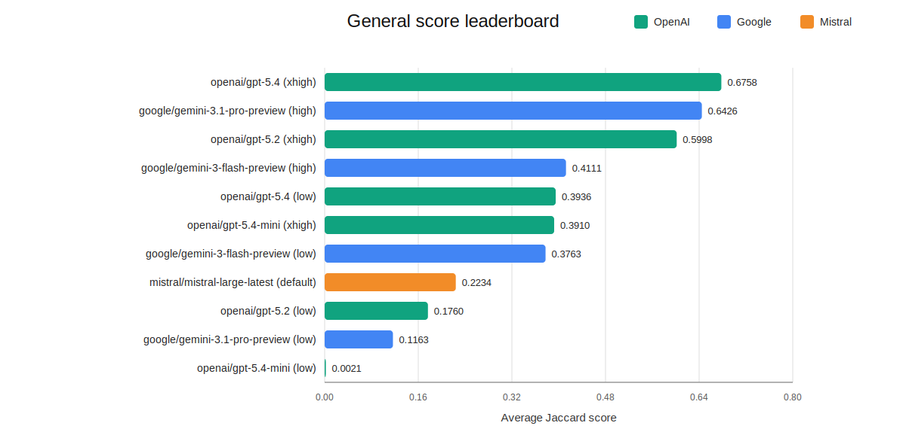
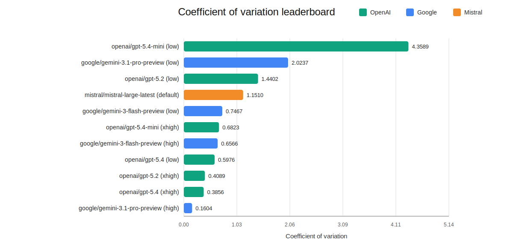
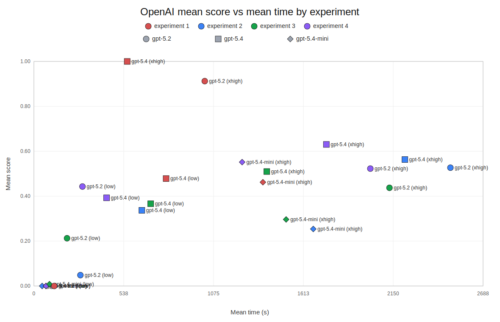
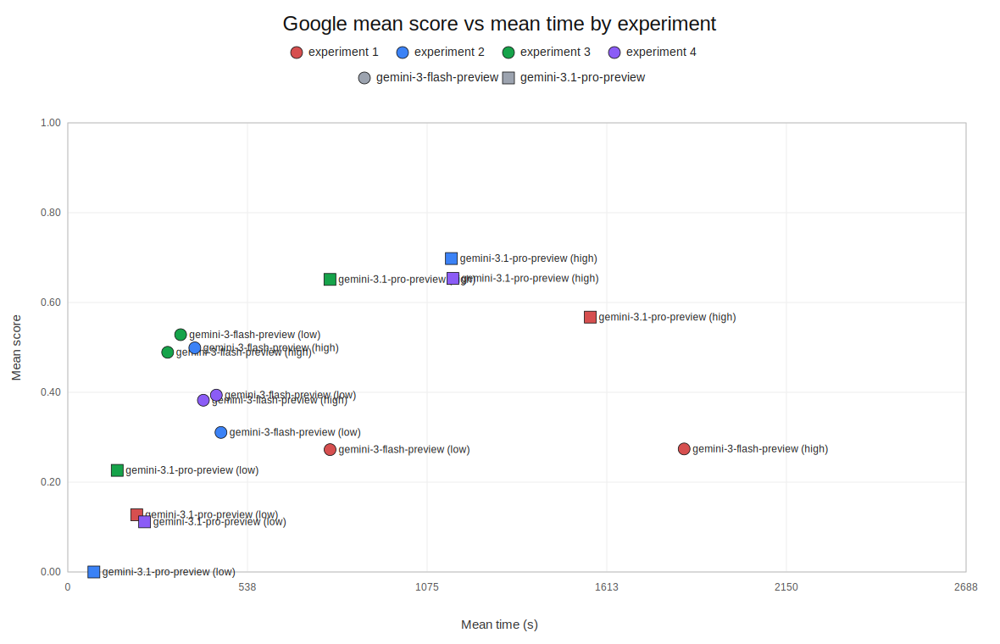
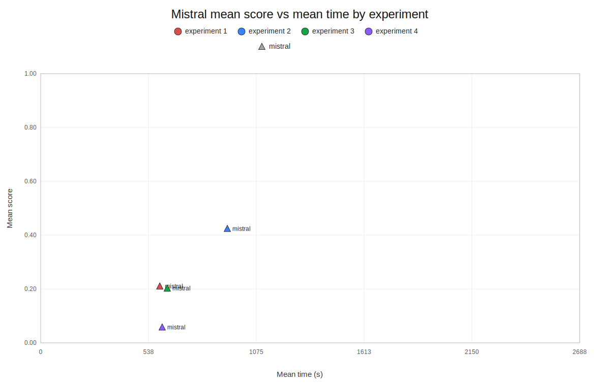
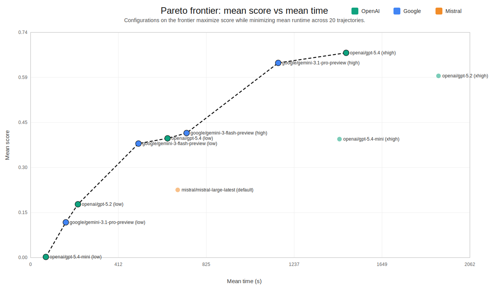

# LLM Benchmarking on Business Problems via Agent-Based Simulation

## Repository purpose

This repository is intended as a compact public summary of a broader benchmarking approach. Its main purpose is to show that LLMs can be evaluated on realistic and commercially valuable business cases modeled with agent-based simulations, rather than only on abstract reasoning tasks or generic benchmark suites.

The supply-chain problem presented here is one example of that approach. In this example, some producers occasionally deliver low-quality product batches, and the analytical task is to identify which producers were actually responsible for downstream quality problems using only operational data and resulting customer behavior. This is a data analysis task that, in a real business setting, would typically be performed by a data analyst or data scientist.

The problem was deliberately selected as a medium-difficulty case. That makes it useful for evaluation because different model families and reasoning settings already show interesting and practically important differences in score, speed, and stability, while the underlying agent-based simulation approach can support substantially harder problem variants as well.

Medium-difficulty business problems are especially valuable for understanding the real business value of LLMs. If model providers want to build trust in AI for operational use, they need to demonstrate not only occasional success, but reliable and highly repeatable performance on meaningful business tasks.

It is important to note that agent-based simulation can also be used to construct substantially more difficult problem settings.

## Goal

The main goal of the benchmark is to evaluate how well LLMs can solve realistic business data analysis problems modeled in agent-based simulations. The current benchmark focuses on a medium-difficulty analytical investigation task in a supply-chain setting.

For each product, the model has to identify the producers whose deliveries truly caused quality-related customer reactions. This means distinguishing between:

- suppliers that were present in the system,
- suppliers that coincided with the problem,
- suppliers whose batches actually reached stores and led to lower demand later on.

This setup is relevant to real business settings such as food retail, pharmaceuticals, cosmetics, and electronics, where product quality issues can propagate through the supply chain and become visible only indirectly through later commercial outcomes.

## Method

We evaluated models in a single simulated environment with one shared ground truth and repeated each setup across multiple independent trajectories.

### Simulation task

Each simulated day follows the same basic flow:

1. Customers visit stores and try to buy products.
2. Stores sell available stock and reorder when inventory is low.
3. The wholesaler gathers supply from producers and distributes it to stores.
4. Customers who receive products below their quality threshold reduce future demand.

Because quality problems appear mainly through their downstream effects, the task cannot be solved by reading one label or one table. Models must infer causality from traces across store orders, wholesaler deliveries, store sales, and later demand changes.

### Experimental design

We ran four benchmark settings:

| Experiment | Input setting | Purpose |
| --- | --- | --- |
| 1 | Raw data only with a short prompt | Reference condition |
| 2 | Raw data only with a more directive prompt | Tests prompt sensitivity |
| 3 | Raw data plus an additional redundant table | Tests robustness to extra information |
| 4 | Raw data only with a more explicit, non-ambiguous prompt | Tests whether clearer task specification improves reliability |

Each model was evaluated on 5 trajectories per experiment, for 20 trajectories in total. Failed or stalled runs were retried once; if no valid output was produced, the trajectory received a score of `0`.

The evaluation metric was Jaccard score, comparing each model's predicted set of problematic producers against the ground-truth set.

All runs used the same evaluation harness and default model temperature settings. Most models were tested in both low- and high-reasoning variants.

## Results

### Overall leaderboard

Across 20 trajectories, the strongest average Jaccard score was achieved by `openai/gpt-5.4` in the `xhigh` reasoning setting, followed by `google/gemini-3.1-pro-preview` in `high` mode and `openai/gpt-5.2` in `xhigh` mode.

| Rank | Model | Variant | Average score |
| --- | --- | --- | --- |
| 1 | `openai/gpt-5.4` | `xhigh` | 0.6758 |
| 2 | `google/gemini-3.1-pro-preview` | `high` | 0.6426 |
| 3 | `openai/gpt-5.2` | `xhigh` | 0.5998 |
| 4 | `google/gemini-3-flash-preview` | `high` | 0.4111 |
| 5 | `openai/gpt-5.4` | `low` | 0.3936 |
| 6 | `openai/gpt-5.4-mini` | `xhigh` | 0.3910 |
| 7 | `google/gemini-3-flash-preview` | `low` | 0.3763 |
| 8 | `mistral/mistral-large-latest` | `default` | 0.2234 |
| 9 | `openai/gpt-5.2` | `low` | 0.1760 |
| 10 | `google/gemini-3.1-pro-preview` | `low` | 0.1163 |
| 11 | `openai/gpt-5.4-mini` | `low` | 0.0021 |

### Main findings

- Performance varied substantially across experiments and trajectories, even though the underlying ground truth was fixed.
- Prompting mattered, but not monotonically: experiment 2 was the weakest overall setting, while experiment 4 recovered much of that loss by making the task specification more explicit.
- Redundant information was not neutral: adding an extra table changed performance and stability rather than simply leaving results unchanged.
- Strong best-case runs show that the signal in the data was detectable, but many models still failed to extract it consistently.
- Higher reasoning settings were often important, especially for stronger OpenAI and Google configurations.

### Consistency

Average score alone did not tell the whole story. Some configurations were much more stable than others across repeated runs.

The most stable high-performing configuration in this benchmark remained `google/gemini-3.1-pro-preview` with `high` reasoning effort. `openai/gpt-5.4` with `xhigh` reasoning achieved the highest mean score, but Gemini 3.1 Pro high combined near-top quality with materially lower variance.

### Score vs time

The score-time comparison is shown below as one chart per provider. Each point is one experiment-level mean for a given model-variant configuration. Colors distinguish experiments, while marker shapes distinguish model families within a provider. Labels use compact names such as `gpt-5.2 (xhigh)` to keep the plots readable.

#### OpenAI

#### Google

#### Mistral

### Pareto frontier

Looking at mean score versus mean time across all 20 trajectories per configuration, the Pareto frontier highlights the non-dominated speed-quality trade-offs.

The frontier includes `openai/gpt-5.4-mini (low)`, `google/gemini-3.1-pro-preview (low)`, `openai/gpt-5.2 (low)`, `google/gemini-3-flash-preview (low)`, `openai/gpt-5.4 (low)`, `google/gemini-3-flash-preview (high)`, `google/gemini-3.1-pro-preview (high)`, and `openai/gpt-5.4 (xhigh)`.

The frontier shows that `openai/gpt-5.2 (xhigh)` and `openai/gpt-5.4-mini (xhigh)` improve quality relative to their low-effort counterparts, but they are not efficient frontier choices once runtime is taken into account.

## Interpretation

This benchmark suggests that current LLMs can sometimes solve a structured root-cause analysis problem in simulated business data, but reliability remains a major weakness.

The simulation was intentionally configured to contain many repeated signal patterns over 365 simulated days. In other words, the main challenge was not the absence of evidence, but whether a model could discover and follow an effective analytical strategy. That makes the benchmark a useful test of consistency, causal reasoning, and robustness to prompt and input changes.

## Scope and limitations

- The benchmark uses one simulated environment and one ground truth.
- Results should be interpreted as a controlled comparative study, not as a universal ranking for all analytical tasks.
- The task focuses on delayed causal attribution in supply-chain data, not on general business intelligence performance.

For detailed information about the benchmark design, simulation parameters, and scoring methodology, see the [simulation description](simulation_description.md).

