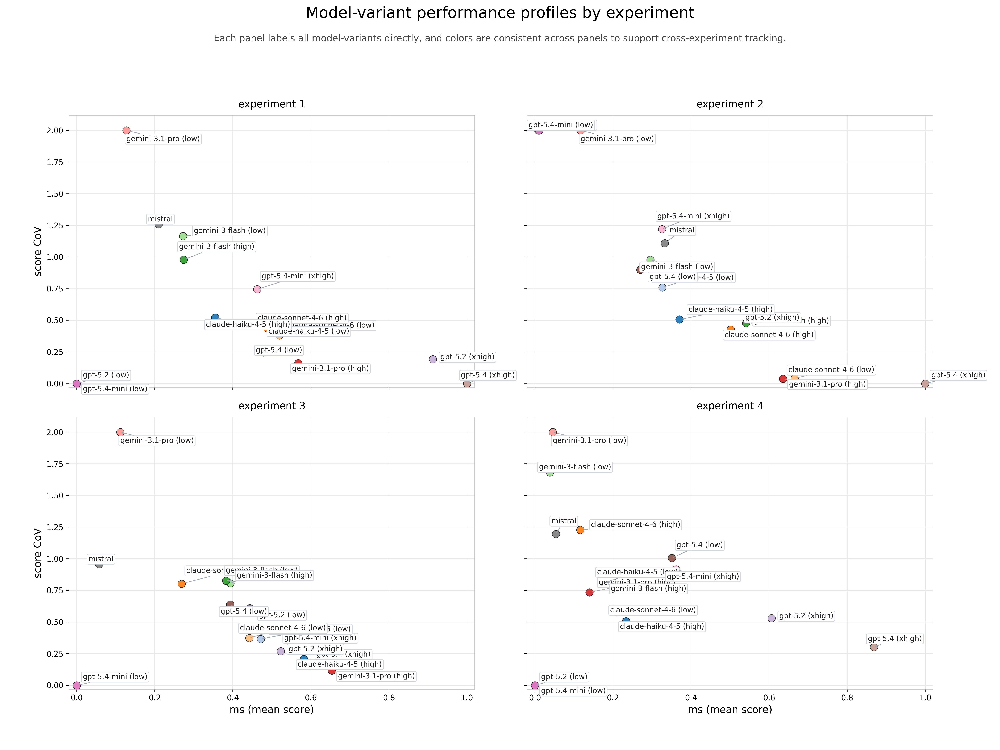

# Business utility of Large Language Models as Exploratory Data Analysis Agents 
April 2026, deepsense.ai

## Abstract

Large Language Models (LLMs) are increasingly used in analytical workflows, but their suitability as exploratory data analysis (EDA) agents in business settings remains uncertain. In practice, a deployable EDA agent must provide not only useful average performance but also sufficient repeatability to support trust in its outputs. We evaluate this requirement in a controlled, business-relevant benchmark built on an agent-based supply chain simulation. The task is to identify supplier-product combinations responsible for low quality and downstream sales loss by reasoning from indirect operational traces rather than from explicit labels. Fifteen model-variant configurations from eight model families were evaluated under four experimental conditions that varied data representation, prompt clarity, and signal strength, with five trajectories per condition. Outputs were scored against deterministic ground truth using the Jaccard index and assessed through a framework that combines mean score (`ms`), coefficient of variation (`CV`), exploratory cross-condition significance tests, and `Business utility`, a risk-adjusted metric that we propose to summarize quality and repeatability in a single operational measure. The results show that most configurations are not dependable enough for autonomous EDA use, even when their average scores appear acceptable. `openai/gpt-5.4` with extra-high reasoning effort achieved the strongest overall profile, with an experiment-averaged `ms` of `0.8748` and an experiment-averaged `Business utility` of `0.6952`, while the next-best configurations lost substantially more utility after variability discounting. Our findings suggest that evaluation of EDA agents should treat average quality, repeatability, and condition sensitivity as complementary dimensions of operational trustworthiness.

## Introduction

Large Language Models have become central components of contemporary AI systems. They are increasingly embedded in agentic workflows, retrieval-augmented pipelines, and interactive analytical tools that allow them to act on external environments rather than merely respond in natural language (Gao et al., 2024; Li, Wang, Zeng, Wu, & Yang, 2024). This shift has intensified interest in whether LLMs can assist or automate specialist tasks that require structured reasoning, procedural execution, and interpretation.

Data analysis is a particularly important case. Existing work shows that LLMs can assist with code generation, notebook completion, and selected data science subtasks, but strong evidence for their use in exploratory data analysis remains limited and fragmented (Jansen et al., 2025; Lai et al., 2022). That gap matters because EDA is not simply a question-answering exercise. It is an iterative analytical process in which the analyst describes data, identifies salient structure, and interprets that structure in relation to the underlying problem (De Mast & Trip, 2007; Tukey, 1977). 

This research asks whether an LLM embedded in an agentic harness can function as a dependable EDA agent under realistic business conditions. The argument starts from a practical notion of trust: in organizational settings, a model is useful only if it combines acceptable average performance with low variability, because high volatility increases verification costs and makes failures difficult to anticipate. For that reason, the evaluation extends beyond benchmark means to include repeatability and sensitivity to realistic changes in working conditions. To formalize that perspective, the paper introduces a synthetic metric, `Business utility`, that aggregates performance and reliability in a single value between `0` and `1`. The metric treats mean score as expected analytical value and discounts that value by instability through a prospect-theory-inspired loss function over variability, with that relation discussed later in the evaluation framework (Kahneman & Tversky, 1979; Tversky & Kahneman, 1992).

This paper presents a benchmark built around a realistic business scenario. We evaluate 15 model-variant configurations on an agent-based simulation of a supply chain in which the task is to infer which supplier-product combinations caused low quality and downstream sales loss. The paper makes three contributions. First, it introduces a controlled benchmark that operationalizes EDA as a causal reconstruction problem over business-process data. Second, it proposes a risk-adjusted evaluation framework that combines mean task quality with variability. Third, it provides empirical evidence that current LLMs remain operationally fragile as autonomous EDA agents, with instability emerging as the main obstacle to dependable deployment.

## Background: Exploratory Data Analysis

Exploratory data analysis is commonly understood as a process of learning from data before confirmatory testing. Tukey (1977) framed EDA as a way to let data suggest patterns, anomalies, and hypotheses rather than merely confirm prior expectations. Later work emphasized that EDA is not reducible to descriptive statistics alone. Instead, it combines data display, pattern discovery, anomaly detection, and interpretation in a form that aligns analytical representations with human cognitive strengths (Good, 1983; Morgenthaler, 2009).

For the present study, the most useful formulation is the three-step view proposed by De Mast and Trip (2007): display the data, identify salient features, and interpret salient features. We adopt a slightly expanded wording in which the first step is expressed as *describe the data*. This does not separate descriptive data analysis from EDA as a fully independent phase. Rather, it makes explicit that exploratory work begins by organizing, summarizing, and displaying data in a way that allows salient variation to become visible (Allen et al., 2018; Li Vigni, Durante, & Cocchi, 2013). Under this interpretation, EDA can be described as a three-part process:

1. describe the data,
2. identify salient features,
3. interpret salient features.

This process orientation matters because the endpoint of EDA is not merely a table, a visualization, or a classification label. The endpoint is a set of plausible explanatory hypotheses about which variables or mechanisms deserve further attention. De Mast and Trip (2007) treat this as a hypothesis-generation problem in which patterns, deviations, or structural irregularities in the data motivate subsequent interpretation.

The benchmark in this paper is built around that conception. The solver is not given a clean label indicating which producer is defective. Instead, the solver must inspect operational records, reconstruct how goods moved through the simulated system, detect the traces of quality failure in downstream behavior, and infer which supplier-product pairs plausibly generated those traces. The benchmark therefore treats EDA as structured hypothesis generation rather than as isolated code generation or closed-form question answering.

## Related Work

### Benchmarking Data and ML Agents

The number of benchmarks for LLMs and agents in data science, analytics, and machine learning engineering has grown rapidly in recent years. However, these benchmarks differ substantially in what they test, how they test it, and how close they come to process-oriented EDA. Some focus on code generation or closed-form data-analysis tasks, while others evaluate longer analytical workflows, insight discovery, or tool-grounded agent behavior in realistic environments.

From the perspective of this paper, the most important distinction is between benchmarks that are directly relevant to exploratory or insight-oriented analysis and benchmarks that primarily target machine learning engineering. That distinction matters because a benchmark can be valuable while still leaving the core process of EDA under-specified.

Table 1 summarizes the benchmark landscape that informed this study.

Table 1. **Comparison of benchmarks evaluating ML and data-science agent capabilities**

| Benchmark | Release | Benchmark goal | Evaluation approach | Number of problems | Origin of problems |
| --- | --- | --- | --- | --- | --- |
| **2022** |  |  |  |  |  |
| DS-1000 (Lai et al., 2022) | Nov 2022 | Data science | Execution semantics and test-case constraints determine task success | 1000 | Public domain with modifications |
| **2024** |  |  |  |  |  |
| InfiAgent-DABench (Hu et al., 2024) | Jan 2024 | Data science | Closed-form automatic scoring through format prompting and code execution | 311 | Public datasets and genuine problems not available in the public domain |
| BIBench (Liu et al., 2024) | Feb 2024 | Data science, business intelligence | Classification, extraction, and generation tasks across knowledge, application, and analytical skill | 11 | Public domain |
| DSEval (Zhang, Jiang, et al., 2024) | Feb 2024 | Data science | Bootstrapped annotations, validator feedback on code execution, and oracle-agent comparison | 4 benchmarks | Public domain |
| MLAgentBench (Huang, Vora, Liang, & Leskovec, 2024) | Jun 2024 | Machine learning engineering | Success rate, efficiency, and evaluator scoring in end-to-end experimentation tasks | 13 | Public domain |
| Spider2-V (Cao et al., 2024) | Jul 2024 | Multimodal data-science and engineering workflows | Task-specific programmatic verifiers in real desktop environments | 494 | Genuine workflow tasks from tutorials and real projects |
| ML-Bench (Tang et al., 2024) | Aug 2024 | Machine learning engineering | Pass@K for text-to-code and success rate for end-to-end agent execution | 9641 | Public domain |
| DA-Code (Huang et al., 2024) | Oct 2024 | Data science | Execution-based correctness in a sandboxed environment | 500 | Public datasets and genuine problems not available in the public domain |
| SWE-bench (Jimenez et al., 2024) | Nov 2024 | Software engineering | Patch resolution and test-passing outcomes on real issues | 2294 | Public domain |
| RE-Bench (Wijk et al., n.d.) | 2024 | Machine learning engineering | Task-specific scores in open-ended environments normalized to human baselines | 7 | Genuine datasets and problems |
| **2025** |  |  |  |  |  |
| DSBench (Jing et al., 2025) | Feb 2025 | Data science | Semantic similarity, relative performance gap, and task success rate | 540 | Public domain |
| DataSciBench (Zhang, Zhoubian, et al., 2025) | Feb 2025 | Data science | Semi-automated LLM assessment combined with human judgments and programmed rules | 222 | Public domain, human made, and LLM generated |
| MLE-bench (Chan et al., 2025) | Feb 2025 | Machine learning engineering | Offline Kaggle competition performance compared with human submissions | 75 | Public domain |
| IDA-Bench (Li, Liu, et al., 2025) | Jun 2025 | Interactive guided data analysis | Final performance against human notebook baselines in multi-round workflows | 25 | Recent Kaggle notebooks with curated task distillation |
| DABstep (Egg et al., 2025) | Jun 2025 | Multi-step data analysis reasoning | Objective factoid scoring with numeric tolerance and normalized string or list matching | 450+ | Genuine anonymized industry analytical workloads |
| Text2Vis (Rahman et al., 2025) | Jul 2025 | Text-to-visualization generation | Combined short-answer correctness, code execution, and chart-quality criteria | 1985 | Curated public tables and generated queries with human verification |
| NL2SQL-BUGs (Liu, Shen, Li, Tang, & Luo, 2025) | Aug 2025 | NL2SQL semantic error detection | Binary and type-specific semantic error detection | 2018 | Public-domain construction from BIRD with expert annotations |
| FDABench (Wang et al., 2025) | Sep 2025 | Data analysis over heterogeneous data | Exact match, ROUGE, and efficiency metrics across workflow types | 2007 | Public benchmarks extended with curated unstructured context |
| InsightEval (Zhu et al., 2025) | Nov 2025 | Insight discovery in EDA | Insight recall, precision, F1, and novelty scoring | 100 instances | Expert-curated and human-verified benchmark instances |
| DAComp (Lei et al., 2025) | Dec 2025 | Full data-intelligence lifecycle | Execution-based scoring for deterministic tasks and rubric-guided LLM judging for open-ended analysis | 210 | Genuine enterprise-inspired schemas and curated analytical databases |
| TimeSeriesGym (Cai et al., 2025) | 2025 | Time-series ML engineering | Quantitative artifact metrics, programmatic checks, and LLM-judge scoring | 34 | Public competitions and curated repository tasks |
| nvBench 2.0 (Luo et al., 2025) | 2025 | Ambiguous text-to-visualization reasoning | Precision@K, Recall@K, and F1@K over multiple valid visualizations | 7878 | Public tables transformed through controlled ambiguity injection |
| **2026** |  |  |  |  |  |
| ML-Tool-Bench (Chittepu et al., 2026) | Feb 2026 | Tool-augmented ML planning | Validity of long-horizon tool trajectories and leaderboard percentile performance | 15 | Public Kaggle tasks with curation and subsampling |

Several patterns are visible in this comparison. First, benchmark scale varies dramatically. Some benchmarks contain only a few highly complex open-ended tasks, whereas others contain thousands of more standardized problems. This difference matters because a large benchmark is not necessarily closer to process-oriented EDA than a smaller but more realistic workflow benchmark. Second, task provenance varies from public repositories, StackOverflow, and Kaggle competitions to expert-curated industry-style problems. Publicly available tasks are useful for scale and reproducibility, but they also carry a greater risk that similar tasks may appear in model training data. Third, evaluation logic varies from exact execution-based scoring to semantic similarity, human or oracle baselines, insight metrics, and LLM-as-judge protocols. 

### The Gap Addressed by This Study

Despite this growth, none of the reviewed benchmarks are dedicated solely to full process-oriented EDA in the sense adopted in this paper. Some benchmarks are clearly EDA-adjacent. `InsightEval` focuses on insight discovery, `IDA-Bench` focuses on interactive guided analysis, `DABstep` evaluates multi-step analytical reasoning, and `DAComp` includes open-ended data-analysis tasks. These are important advances. However, they do not fully cover the specific EDA sequence emphasized by De Mast and Trip (2007): describing data, identifying salient features, and interpreting them in relation to an explanatory problem.

This gap motivates the present benchmark. The task is not primarily about producing code, generating a chart, or passing a closed-form verifier. It is about reconstructing a hidden causal pattern from business-process data. That makes the study relevant to the broader literature on data science agents while also targeting a narrower problem: whether LLMs can function as dependable exploratory data analysts when success requires both inference quality and repeatability to build trust among decision makers and therefore increase a probability of successful adoption in the organization.

## Methods

### Research Objective

The primary objective of the study is to assess the `Business utility` of LLM-based EDA agents in a controlled but business-relevant analytical task. More specifically, the study asks which model-variants combine useful task performance with enough reliability to support trust in their outputs.

This objective is evaluated through a hierarchy of complementary metrics:

1. `ms` (`mean score`) captures average analytical quality.
2. `CV` (`Coefficient of Variation`) captures unpredictability.
3. `Business utility` provides a risk-adjusted synthesis of quality and variability.
4. Condition sensitivity, operationalized through Mann-Whitney U and Kruskal-Wallis tests, indicates whether model behavior shifts across experimental conditions.

Cross-experiment testing in this research is interpreted as an auxiliary descriptor of model behavior alongside `ms`, `CV`, and `Business utility`.

### Benchmark Task and Simulation Context

The benchmark is built on an agent-based simulation of a supply chain for everyday consumer goods. Products flow from producers through a wholesaler to stores and then to customers. The practical problem arises when some producers deliver low-quality batches. Poor quality does not appear as a direct label in the data. Instead, it generates downstream traces in customer demand, store orders, wholesaler allocations, and store sales.

The solver is therefore required to analyze the available records, reconstruct where goods reaching stores came from, connect supplier deliveries with later customer behavior, and identify the producers who were the real source of quality problems for particular goods. This design makes the task analytically meaningful because it resembles a realistic business diagnosis problem in which the cause of performance degradation must be inferred from indirect operational evidence rather than read off a single field.

### Experimental Design

All experiments used a supply chain simulation, but the analytical environment was varied in ways intended to approximate realistic differences in how a human analyst may encounter the same business problem. The four experiments (we refer to experiments also as conditions) were defined as shown in Table 2.

Table 2. **Experimental conditions**

| Experiment | Data representation | Prompt | Simulation setup and signal |
| --- | --- | --- | --- |
| `Experiment 1` (reference) | Raw data | Short | Simulation setup 1 with clear and strong signal |
| `Experiment 2` | Raw data and redundant tabular data | Short | Simulation setup 1 with clear and strong signal |
| `Experiment 3` | Raw data | Non-ambiguous | Simulation setup 1 with clear and strong signal |
| `Experiment 4` | Raw data | Short | Simulation setup 2 with clear but weaker signal |

Each model-variant was evaluated on five trajectories per experiment, for 20 trajectories in total. If a trajectory failed, one retry was granted for that trajectory. If the retry also failed to produce an output, the trajectory received a score of `0`. Failure was defined as either missing JSON output or a stalled run with no `stdout` or `stderr` change for 1200 seconds. All trajectories were executed with the same OpenCode harness (`v1.2.27`) and default setup, without additional custom instructions such as `agents.md`. All models were evaluated with their default temperature settings.

Most models were tested in low and high reasoning-effort variants (called model-variants), while `mistral/mistral-large-latest` exposed only a default configuration.

### Models and Output Scoring

The benchmark covered eight LLM families and 15 model-variant configurations. The output required from each run was a JSON object containing the predicted set of supplier-good combinations associated with the quality problem. Predictions were compared against deterministic ground truth using the Jaccard score. This choice reflects the practical objective of recovering all relevant supplier-good pairs while avoiding false inclusions.

### Evaluation Framework

At the empirical level, each trajectory contributed two raw measurements: task score and completion time. These values were then aggregated by experiment and by model-variant. Three descriptors are reported directly:

1. `ms`, which estimates average analytical correctness.
2. `CV`, which quantifies relative variation in score within the same condition.
3. `mean time`, which estimates average execution cost.

At the interpretive level, these quantities are translated into a risk-adjusted assessment. The motivation is operational rather than purely descriptive. A model can have an acceptable mean score and still be unsuitable for deployment if its behavior is too unstable to support selective verification. For that reason, the benchmark treats efficacy and repeatability as jointly necessary conditions of usefulness for business purposes.

The baseline quantity is `ms`, the mean score observed for a model in one experiment. This quantity captures expected analytical usefulness, but it does not account for how reproducibly that usefulness is delivered. To capture that second aspect, the benchmark uses the coefficient of variation `CV = standard deviation / ms`. The appeal of `CV` is that it is scale-invariant: it measures relative rather than absolute instability, which makes comparisons more meaningful across task settings with different baseline difficulty.

The study introduces the following metric:

- `Business utility = ms * D(CV) = ms * exp(-L(CV)) = ms * exp(-2.25 * CV^0.88)`

where `ms` is the mean score and `CV` is the coefficient of variation. The metric can be decomposed into two parts. First, instability is mapped into a prospect-theory-inspired loss term, `L(CV) = 2.25 * CV^0.88`. Second, that loss is translated into a bounded stability discount, `D(CV) = exp(-L(CV))`. `Business utility` is therefore the product of expected analytical usefulness and a smooth discount for instability.

This construction is designed to preserve three properties that are important in the present benchmark. First, utility remains bounded between `0` and `ms`, so higher instability always lowers the summary without generating logically inconsistent negative values. Second, the discount is nonlinear, which allows small departures from ideal repeatability to matter more than they would under a purely proportional penalty. Third, the multiplicative form keeps the interpretation operationally simple: a model receives high utility only when it is both accurate on average and sufficiently repeatable.

From a decision-theoretic perspective, the key design choice is the instability loss term `L(CV) = 2.25 * CV^0.88`. Its parameters are taken from the loss-side parametrization of cumulative prospect theory, where `2.25` captures loss aversion and `0.88` captures the curvature of the value function (Tversky & Kahneman, 1992). In the present benchmark, those parameters are not used to model monetary outcomes directly. Instead, they are repurposed to express the idea that departures from ideal repeatability should reduce perceived usefulness in a nonlinear way. Under this interpretation, low instability remains highly valuable, whereas increases in `CV` are translated into a progressively accumulated loss of trust.

For fixed `CV`, the metric remains linear in `ms` - each increment in mean task quality contributes proportionally to `Business utility`. The resulting construction is therefore hybrid - the instability term is prospect-theory-inspired, whereas the efficacy term remains proportional and directly interpretable. This separation is deliberate. It preserves a simple reading of `ms` as expected analytical usefulness while allowing instability to discount that usefulness through a nonlinear loss-sensitive transformation.

One technical convention requires caution. For groups with `ms = 0`, we must have `standard deviation = 0` as well and the existing aggregation logic sets `CV = 0.0` to avoid undefined division. Under this convention, `Business utility` remains `0`, which is intuitive for fully collapsed zero-score states, but the derived stability discount is not substantively informative in those cases.

Cross-condition significance testing serves a different purpose. Two-sided Mann-Whitney U tests compare score distributions between the reference condition and selected interventions, while the Kruskal-Wallis test evaluates whether a model-variant exhibits any detectable distribution shift across all four experiments. Because each comparison is based on a very small sample and the study evaluates multiple model-specific contrasts without multiplicity correction, the resulting `p` values are interpreted as exploratory diagnostic signals rather than confirmatory evidence.

## Results

### Mean performance across experiments

The benchmark covered 4 experiments, with 5 trajectories for each 15 model-variants (from 8 LLM families), producing 300 scored trajectories in total, with 75 trajectories per experiment. The overall `ms` across all trajectories was `0.3562`, and mean runtime was `783.56` seconds. Performance was highest in the reference experiment and lowest in the weaker-signal condition.

Table 3. **Mean performance across experiments**

| Scope | n trajectories | `ms` | Mean time (s) |
| --- | --- | --- | --- |
| Overall | 300 | 0.3562 | 783.56 |
| `experiment_1` | 75 | 0.4088 | 774.84 |
| `experiment_2` | 75 | 0.3972 | 650.54 |
| `experiment_3` | 75 | 0.3936 | 751.00 |
| `experiment_4` | 75 | 0.2253 | 957.86 |

The strongest aggregate degradation appears in `experiment_4`, where the underlying signal is weaker and the simulation setup changes. By contrast, the addition of redundant tabular aggregates in `experiment_2` and the non-ambiguous prompt in `experiment_3` do not materially shift the pooled `ms`. Mean values alone, however, remain incomplete because they can hide large within-condition dispersion.

### Business utility based ranking

The practical effect of that dispersion becomes clearer once the risk-adjusted metric is applied. Table 4 ranks all 15 model-variants by experiment-averaged `Business utility`. The ranking differs materially from a ranking based on `ms` alone. For example, `google/gemini-3.1-pro-preview` `high` remains above `openai/gpt-5.2` `xhigh` because its average `CV` is lower and therefore its average stability discount is weaker. 

Table 4. **Global ranking by experiment-averaged Business utility**

| Rank | Model | Variant | Experiment-averaged `ms` | Experiment-averaged `CV` | Experiment-averaged stability discount | Experiment-averaged `Business utility` |
| --- | --- | --- | --- | --- | --- | --- |
| 1 | `openai/gpt-5.4` | `xhigh` | 0.8748 | 0.1202 | 0.7665 | 0.6952 |
| 2 | `google/gemini-3.1-pro-preview` | `high` | 0.4991 | 0.2622 | 0.6031 | 0.3533 |
| 3 | `openai/gpt-5.2` | `xhigh` | 0.6501 | 0.3739 | 0.4126 | 0.2815 |
| 4 | `anthropic/claude-sonnet-4-6` | `low` | 0.4597 | 0.3434 | 0.4728 | 0.2506 |
| 5 | `anthropic/claude-haiku-4-5` | `high` | 0.3850 | 0.4361 | 0.3573 | 0.1513 |
| 6 | `anthropic/claude-haiku-4-5` | `low` | 0.3620 | 0.6022 | 0.2586 | 0.1044 |
| 7 | `openai/gpt-5.4` | `low` | 0.3730 | 0.6973 | 0.2431 | 0.1016 |
| 8 | `anthropic/claude-sonnet-4-6` | `high` | 0.3432 | 0.7240 | 0.2263 | 0.0966 |
| 9 | `openai/gpt-5.4-mini` | `xhigh` | 0.4252 | 0.8091 | 0.1934 | 0.0929 |
| 10 | `google/gemini-3-flash-preview` | `high` | 0.3419 | 0.7755 | 0.1799 | 0.0700 |
| 11 | `google/gemini-3-flash-preview` | `low` | 0.2501 | 1.1577 | 0.0926 | 0.0289 |
| 12 | `openai/gpt-5.2` | `low` | 0.1128 | 0.6526 | 0.5622 | 0.0258 |
| 13 | `mistral/mistral-large-latest` | `default` | 0.1635 | 1.1297 | 0.0839 | 0.0130 |
| 14 | `google/gemini-3.1-pro-preview` | `low` | 0.1003 | 2.0000 | 0.0159 | 0.0016 |
| 15 | `openai/gpt-5.4-mini` | `low` | 0.0027 | 0.5000 | 0.7540 | 0.0001 |

The ranking places `openai/gpt-5.4` `xhigh` clearly above the remaining configurations under the revised discount. Its experiment-averaged `ms` remains the highest, and its experiment-averaged `CV` of `0.1202` still preserves a strong average stability discount of `0.7665`, leaving an experiment-averaged `Business utility` of `0.6952`. The next tier consists of `google/gemini-3.1-pro-preview` `high`, `openai/gpt-5.2` `xhigh`, and `anthropic/claude-sonnet-4-6` `low`. The change in ordering between the latter two is substantive - under the prospect-theory-inspired discount, `openai/gpt-5.2` `xhigh` recovers enough utility from its stronger mean performance to overtake the more stable but lower-scoring `anthropic/claude-sonnet-4-6` `low`.

The full per-experiment profile is shown in Figure 1.

Figure 1. **Model-variant performance profiles across experiments**

The chart reinforces three conclusions. First, only a small subset of configurations occupies a clearly favorable region with both high `ms` and low `CV`. Second, the relative positions of the same variants differ across the four panels rather than following one common directional pattern, which is consistent with the selective condition-sensitivity results. Third, many variants with moderate `ms` still occupy high-variability regions, confirming that within-condition instability remains a central obstacle to dependable deployment even when average task quality appears acceptable.

### Condition Sensitivity

Condition sensitivity is visible but not strong enough to eclipse the larger issue of within-condition variability. At the pooled level, only the comparison between `experiment_1` and `experiment_4` crosses the conventional `p <= 0.05` threshold. Because `experiment_4` combines weaker signal with a different simulation setup and ground truth, this result should be read as evidence of sensitivity to the strongest combined perturbation in the benchmark, not as an isolated estimate of a pure signal-strength effect.

Table 5. **Pooled condition sensitivity across experiments**

| `ms` across all trajectories | Mean time (s) across all trajectories | MWU p (`exp1` vs `exp2`) | MWU p (`exp1` vs `exp3`) | MWU p (`exp1` vs `exp4`) | Kruskal-Wallis p (`exp1` to `exp4`) |
| --- | --- | --- | --- | --- | --- |
| 0.3562 | 783.56 | 0.811397 | 0.908204 | 0.000908* | 0.000251* |

\* `p <= 0.05`

At the model-variant level, condition sensitivity is selective rather than universal. No model-variant crosses the `p <= 0.05` threshold for the comparison between `experiment_1` and `experiment_2`, which is consistent with the view that adding redundant tabular aggregates did not systematically change performance in this dataset. Three variants cross the threshold for `experiment_3`, and two variants cross it for `experiment_4`. Six variants also cross the threshold in the omnibus Kruskal-Wallis screen across all four experiments.

Table 6. **Model-variant condition sensitivity**

| Model | Variant | `ms` across all trajectories | Mean time (s) across all trajectories | MWU p (`exp1` vs `exp2`) | MWU p (`exp1` vs `exp3`) | MWU p (`exp1` vs `exp4`) | Kruskal-Wallis p (`exp1` to `exp4`) |
| --- | --- | --- | --- | --- | --- | --- | --- |
| `anthropic/claude-haiku-4-5` | `high` | 0.3850 | 393.53 | 1.000000 | 0.095238 | 0.397615 | 0.044408* |
| `anthropic/claude-haiku-4-5` | `low` | 0.3620 | 321.77 | 0.396144 | 1.000000 | 0.201677 | 0.312334 |
| `anthropic/claude-sonnet-4-6` | `high` | 0.3432 | 1501.60 | 0.600402 | 0.150794 | 0.034454* | 0.035554* |
| `anthropic/claude-sonnet-4-6` | `low` | 0.4597 | 1025.11 | 0.332112 | 0.690476 | 0.057008 | 0.019168* |
| `google/gemini-3-flash-preview` | `high` | 0.3419 | 1174.01 | 0.117525 | 0.666430 | 0.828812 | 0.179447 |
| `google/gemini-3-flash-preview` | `low` | 0.2501 | 784.67 | 0.599286 | 0.595883 | 0.372748 | 0.292211 |
| `google/gemini-3.1-pro-preview` | `high` | 0.4991 | 1229.54 | 0.420635 | 0.222222 | 0.007937* | 0.007058* |
| `google/gemini-3.1-pro-preview` | `low` | 0.1004 | 211.67 | 1.000000 | 1.000000 | 1.000000 | 0.996306 |
| `mistral/mistral-large-latest` | `default` | 0.1635 | 705.14 | 0.294802 | 1.000000 | 0.666430 | 0.363966 |
| `openai/gpt-5.2` | `low` | 0.1128 | 200.37 | 0.423711 | 0.007495* | 1.000000 | 0.000849* |
| `openai/gpt-5.2` | `xhigh` | 0.6501 | 1244.53 | 0.083265 | 0.031141* | 0.151494 | 0.158790 |
| `openai/gpt-5.4` | `low` | 0.3730 | 711.01 | 0.205903 | 0.547619 | 0.142457 | 0.393770 |
| `openai/gpt-5.4` | `xhigh` | 0.8748 | 899.42 | 1.000000 | 0.007495* | 0.423711 | 0.004349* |
| `openai/gpt-5.4-mini` | `low` | 0.0027 | 88.51 | 0.423711 | 1.000000 | 1.000000 | 0.391625 |
| `openai/gpt-5.4-mini` | `xhigh` | 0.4252 | 1262.49 | 0.528359 | 0.841270 | 0.753298 | 0.596476 |

\* `p <= 0.05`

These findings support a measured interpretation. The benchmark does reveal condition sensitivity, but not in a way that would justify treating environmental shifts as the primary source of risk. For most variants, the more substantial problem is that repeated runs under the same condition still yield inconsistent quality.

## Discussion

### Main findings

Taken together, the present evidence does not support a broad claim that current LLM agents are ready to serve as reliable autonomous EDA experts in this task setting. Most evaluated model-variants either perform too weakly, vary too strongly within the same condition, or show sensitivity to at least one environmental intervention. The results also indicate that reasoning effort materially changes model behavior. In several families, higher-effort variants perform much better than their lower-effort counterparts, with the clearest examples being `openai/gpt-5.4` and `openai/gpt-5.2`. However, that effect is not uniform across all families or variants, which suggests that additional reasoning budget changes performance substantially without reliably producing stable analytical competence.

At the same time, the study shows that forms of instability are not equally important. Cross-experiment sensitivity is informative because it reveals where model behavior changes when the analytical environment changes. However, it is not the dominant source of risk in this benchmark. The larger issue for most configurations is within-experiment unpredictability, captured by high `CV` and translated into a weak stability discount. Many variants appear not to apply a robust exploratory strategy consistently. Instead, repeated runs under the same condition often diverge between productive and unproductive lines of reasoning, which suggests unstable strategy discovery rather than reliable problem understanding. This pattern remains visible even for configurations given substantial reasoning effort and execution time.

Across model-variants, the average `Business utility` is `0.1511`, whereas the average `ms` is `0.3562`, which means the risk-adjusted summary is only about `42%` as large as the mean-score summary. Mean performance therefore overstates practical readiness when instability is high. It shows that conclusions about practical usefulness depend not only on measured instability itself, but also on how sharply the evaluation framework translates that instability into discounted utility.

### Relation to EDA Theory

The benchmark findings also matter specifically for EDA rather than only for generic task completion. In classical EDA, the analyst is not simply retrieving a known answer but forming and refining plausible hypotheses from partial structure in the data (De Mast & Trip, 2007; Good, 1983; Tukey, 1977). That process depends on consistency. An analyst who describes the same data differently on each pass, notices different salient features in each repeated attempt, or interprets them inconsistently would not be regarded as dependable. The same standard should apply to LLM-based EDA agents.

This point helps explain why within-condition variance is so damaging in the present benchmark. The task is not ambiguous, as evidenced by multiple perfect scores achieved by some model-variants. The simulation was intentionally configured to contain repeated signal traces that make near-optimal performance possible. The problem is therefore not that the data are too noisy to support correct reasoning, but that most models do not reliably discover and execute a workable exploratory strategy.

### Relation to Prior Benchmark Literature

The findings are also consistent with a broader trend in the recent benchmark literature. Benchmarks such as `DSBench`, `IDA-Bench`, `DA-Code`, `DAComp`, and `Spider2-V` all suggest that average task success overstates practical readiness when tasks become realistic, multi-step, or tool-grounded (Cao et al., 2024; Huang et al., 2024; Jing et al., 2025; Lei et al., 2025; Li, Liu, et al., 2025). `InsightEval` and `FDABench` similarly show that evaluating analytical agents requires richer metrics than one scalar accuracy score because insight quality, workflow quality, and heterogeneous evidence handling all matter (Wang et al., 2025; Zhu et al., 2025).

The present study extends that literature in two ways. First, it narrows the focus to a process-oriented EDA problem rather than a broader data-agent task bundle. Second, it shows that a benchmark can look more favorable than it really is if repeatability is ignored. The high variance observed here suggests that the practical gap between occasional analytical success and dependable analytical use remains substantial even when the underlying task structure is strong enough to permit near-perfect answers.

### Implications for Deployment

From a deployment perspective, the results support a cautious interpretation of current LLM-based analytics. Organizations should realistially assess if model performs well enough, often enough, and predictably enough to reduce rather than increase verification burden. An equally important question is what level of `Business utility` would be sufficient for managers in real organizations to accept EDA agents as viable substitutes for human analysts in at least some exploratory tasks. The present benchmark helps structure that question, but it does not yet establish a deployment threshold. 

## Conclusion

This study leads to a cautious but substantively important conclusion about LLM-based EDA agents. In the present benchmark, the central obstacle to practical adoption is not merely that many models fail to reach a sufficiently high mean score. The deeper problem is that average performance is often coupled with high within-condition dispersion and, for some variants, selective sensitivity to changes in the analytical environment. In operational terms, that means a model may appear competent on average while still remaining unreliable in repeated use. For exploratory analysis, this is a critical weakness, because EDA is valuable only when the analyst can repeatedly recover meaningful structure from the same underlying evidence rather than alternate unpredictably between productive and unproductive reasoning paths.

The paper contributes to model-evaluation methodology. Rather than treating `ms` as a sufficient indicator of readiness, it proposes a reporting framework in which `ms`, `CV`, `Business utility`, and condition sensitivity play distinct but complementary roles. `ms` captures average analytical quality, `CV` captures unpredictability, `Business utility` translates quality and repeatability into a single risk-adjusted summary, and the non-parametric cross-condition tests provide an auxiliary view of environmental sensitivity. This framework matters because it shifts evaluation away from a narrow question of whether a model can produce a correct answer at all and toward a more decision-relevant question: whether it can do so often enough and consistently enough to justify trust in realistic use. In that sense, the study is not only an empirical benchmark of current models, but also a methodological argument for evaluating analytical agents in a way that is closer to organizational decision criteria.

The role of `Business utility` is especially important in that contribution. The metric is proposed as a utility-theoretic bridge between raw benchmark outcomes and practical judgments about usefulness. Its prospect-theory-inspired discount does not claim to model managerial behavior directly, but it encodes a plausible operational preference - instability should reduce perceived value because unstable systems impose verification costs and make failure harder to anticipate. This point connects the benchmark to a broader question of AI adoption in organizations (Łabędzki et al., 2025). Managers do not deploy analytical systems on the basis of average capability alone. They deploy systems when expected gains are high enough, and predictable enough, to support trust, accountability, and acceptable oversight burden. From that perspective, the benchmark suggests that trust in AI EDA agents should be understood not as a vague attitude, but as a function of demonstrated analytical quality, repeatability, and robustness under changing conditions.

Taken together, the findings suggest that current frontier models have not yet closed the gap between occasional analytical success and dependable analytical use in this task setting. The strongest configuration, `openai/gpt-5.4` `xhigh`, shows that high-performing and relatively stable EDA-like behavior is possible. However, the broader pattern remains one of operational fragility, with most variants still too unstable to support confident substitution for human analysts. The most important implication is therefore twofold. Substantively, organizations should be cautious about interpreting isolated strong runs or benchmark averages as evidence of deployment readiness. Methodologically, future evaluations of analytical agents should treat trustworthiness, usefulness, and adoption potential as multidimensional constructs that require joint measurement of efficacy, repeatability, and environmental sensitivity rather than reliance on any single scalar score.

## Limitations

The study has several important limitations. First, each model-variant was evaluated on only five trajectories per experiment, which limits the power of non-parametric significance tests and increases uncertainty around variance estimates. Second, the benchmark covers one business problem and one simulation family rather than the full spectrum of EDA work. Third, the final usefulness of `Business utility` depends on the chosen prospect-theory-inspired parametrization and on the decision to embed the resulting loss term inside an exponential discount. Fourth, the accepted convention `CV = 0` for zero-score groups keeps the computation defined but makes the derived stability discount less informative for collapsed states. In those cases, `Business utility` is the more trustworthy indicator.

## References

Allen, T. T., Sui, Z., & Akbari, K. (2018). Exploratory text data analysis for quality hypothesis generation. *Quality Engineering, 30*(4), 701-712. https://doi.org/10.1080/08982112.2018.1481216

Cai, Y., Li, X., Goswami, M., Wilinski, M., Welter, G., & Dubrawski, A. (2025). *TimeSeriesGym: A scalable benchmark for (time series) machine learning engineering agents*. arXiv. https://doi.org/10.48550/arXiv.2505.13291

Cao, R., Lei, F., Wu, H., Chen, J., Fu, Y., Gao, H., Xiong, X., Zhang, H., Mao, Y., Hu, W., Xie, T., Xu, H., Zhang, D., Wang, S., Sun, R., Yin, P., Xiong, C., Ni, A., Liu, Q., Zhong, V., Chen, L., Yu, K., & Yu, T. (2024). *Spider2-V: How far are multimodal agents from automating data science and engineering workflows?* arXiv. https://doi.org/10.48550/arXiv.2407.10956

Chan, J. S., Chowdhury, N., Jaffe, O., Aung, J., Sherburn, D., Mays, E., Starace, G., Liu, K., Maksin, L., Patwardhan, T., Weng, L., & Madry, A. (2025). *MLE-bench: Evaluating machine learning agents on machine learning engineering*. arXiv. https://doi.org/10.48550/arXiv.2410.07095

Chittepu, Y., Addanki, R., Mai, T., Rao, A., & Kveton, B. (2026). *ML-Tool-Bench: Tool-augmented planning for ML tasks*. arXiv. https://doi.org/10.48550/arXiv.2512.00672

De Mast, J., & Trip, A. (2007). Exploratory data analysis in quality-improvement projects. *Journal of Quality Technology, 39*(4), 301-311. https://doi.org/10.1080/00224065.2007.11917697

Egg, A., Goyanes, M. I., Kingma, F., Mora, A., von Werra, L., & Wolf, T. (2025). *DABstep: Data agent benchmark for multi-step reasoning*. arXiv. https://doi.org/10.48550/arXiv.2506.23719

Gao, Y., Xiong, Y., Gao, X., Jia, K., Pan, J., Bi, Y., Dai, Y., Sun, J., Wang, M., & Wang, H. (2024). *Retrieval-augmented generation for large language models: A survey*. arXiv. https://doi.org/10.48550/arXiv.2312.10997

Good, I. J. (1983). The philosophy of exploratory data analysis. *Philosophy of Science, 50*(2), 283-295. https://doi.org/10.1086/289110

Hu, X., Zhao, Z., Wei, S., Chai, Z., Wang, G., Wang, X., Su, J., Xu, J., Zhu, M., Cheng, Y., Yuan, J., Kuang, K., Yang, Y., Yang, H., & Wu, F. (2024). *InfiAgent-DABench: Evaluating agents on data analysis tasks*. arXiv. https://doi.org/10.48550/arXiv.2401.05507

Huang, Q., Vora, J., Liang, P., & Leskovec, J. (2024). *MLAgentBench: Evaluating language agents on machine learning experimentation*. OpenReview. https://openreview.net/forum?id=1Fs1LvjYQW

Huang, Y., Luo, J., Yu, Y., Zhang, Y., Lei, F., Wei, Y., He, S., Huang, L., Liu, X., Zhao, J., & Liu, K. (2024). *DA-Code: Agent data science code generation benchmark for large language models*. arXiv. https://doi.org/10.48550/arXiv.2410.07331

Jansen, J. A., Manukyan, A., Al Khoury, N., & Akalin, A. (2025). Leveraging large language models for data analysis automation. *PLOS ONE, 20*(2), e0317084. https://doi.org/10.1371/journal.pone.0317084

Jimenez, C. E., Yang, J., Wettig, A., Yao, S., Pei, K., Press, O., & Narasimhan, K. (2024). *SWE-bench: Can language models resolve real-world GitHub issues?* arXiv. https://doi.org/10.48550/arXiv.2310.06770

Jing, L., Huang, Z., Wang, X., Yao, W., Yu, W., Ma, K., Zhang, H., Du, X., & Yu, D. (2025). *DSBench: How far are data science agents to becoming data science experts?* arXiv. https://doi.org/10.48550/arXiv.2409.07703

Kahneman, D., & Tversky, A. (1979). Prospect theory: An analysis of decision under risk. *Econometrica, 47*(2), 263-291.

Łabędzki, R., Mikołajczyk, K., Biłyk, A., & Trojanowska, M. (2025). Understanding human-AI collaboration: A systematic review of challenges and research methods in management. In C. Stephanidis, M. Antona, S. Ntoa, & G. Salvendy (Eds.), *HCI International 2025 Posters* (Communications in Computer and Information Science, Vol. 2529, pp. 332-348). Springer. https://doi.org/10.1007/978-3-031-94171-9_32

Lai, Y., Li, C., Wang, Y., Zhang, T., Zhong, R., Zettlemoyer, L., Yih, S. W., Fried, D., Wang, S., & Yu, T. (2022). *DS-1000: A natural and reliable benchmark for data science code generation*. arXiv. https://doi.org/10.48550/arXiv.2211.11501

Lei, F., Meng, J., Huang, Y., Zhao, J., Zhang, Y., Luo, J., Zou, X., Yang, R., Shi, W., Gao, Y., He, S., Wang, Z., Liu, Q., Wang, Y., Wang, K., Zhao, J., & Liu, K. (2025). *DAComp: Benchmarking data agents across the full data intelligence lifecycle*. arXiv. https://doi.org/10.48550/arXiv.2512.04324

Li, H., Liu, H., Zhu, T., Guo, T., Zheng, Z., Deng, X., & Jordan, M. I. (2025). *IDA-Bench: Evaluating LLMs on interactive guided data analysis*. arXiv. https://doi.org/10.48550/arXiv.2505.18223

Li, M. V., Durante, C., & Cocchi, M. (2013). Exploratory data analysis. In *Data handling in science and technology* (Vol. 28, pp. 55-126). Elsevier. https://doi.org/10.1016/B978-0-444-59528-7.00003-X

Li, X., Wang, S., Zeng, S., Wu, Y., & Yang, Y. (2024). A survey on LLM-based multi-agent systems: Workflow, infrastructure, and challenges. *Vicinagearth, 1*(1), 9. https://doi.org/10.1007/s44336-024-00009-2

Liu, S., Zhao, S., Jia, C., Zhuang, X., Long, Z., Wu, Q., Yang, C., Zhou, A., & Lan, M. (2024). *BIBench: Benchmarking data analysis knowledge of large language models*. arXiv. https://doi.org/10.48550/arXiv.2401.02982

Liu, X., Shen, S., Li, B., Tang, N., & Luo, Y. (2025). NL2SQL-BUGs: A benchmark for detecting semantic errors in NL2SQL translation. In *Proceedings of the 31st ACM SIGKDD Conference on Knowledge Discovery and Data Mining* (pp. 5662-5673). https://doi.org/10.1145/3711896.3737427

Luo, T., Huang, C., Shen, L., Li, B., Shen, S., Zeng, W., Tang, N., & Luo, Y. (2025). *nvBench 2.0: Resolving ambiguity in text-to-visualization through stepwise reasoning*. arXiv. https://doi.org/10.48550/arXiv.2503.12880

Morgenthaler, S. (2009). Exploratory data analysis. *WIREs Computational Statistics, 1*(1), 33-44. https://doi.org/10.1002/wics.2

Rahman, M., Laskar, M. T. R., Joty, S., & Hoque, E. (2025). *Text2Vis: A challenging and diverse benchmark for generating multimodal visualizations from text*. arXiv. https://doi.org/10.48550/arXiv.2507.19969

Tang, X., Liu, Y., Cai, Z., Shao, Y., Lu, J., Zhang, Y., Deng, Z., Hu, H., An, K., Huang, R., Si, S., Chen, S., Zhao, H., Chen, L., Wang, Y., Liu, T., Jiang, Z., Chang, B., Fang, Y., Qin, Y., Zhou, W., Zhao, Y., Cohan, A., & Gerstein, M. (2024). *ML-Bench: Evaluating large language models and agents for machine learning tasks on repository-level code*. arXiv. https://doi.org/10.48550/arXiv.2311.09835

Tukey, J. W. (1977). *Exploratory data analysis*. Addison-Wesley.

Tversky, A., & Kahneman, D. (1992). Advances in prospect theory: Cumulative representation of uncertainty. *Journal of Risk and Uncertainty, 5*(4), 297-323.

Wang, Z., Zhang, S., Yuan, H., Zhu, J., Li, S., Dong, W., & Cong, G. (2025). *FDABench: A benchmark for data agents on analytical queries over heterogeneous data*. arXiv. https://doi.org/10.48550/arXiv.2509.02473

Wijk, H., Lin, T., Becker, J., Jawhar, S., Parikh, N., Broadley, T., Chan, L., Chen, M., Clymer, J., Dhyani, J., Ericheva, E., Garcia, K., Goodrich, B., Jurkovic, N., Lajko, A., Nix, S., Sato, L., Saunders, W., Taran, M., West, B., & Barnes, E. (n.d.). *RE-Bench: Evaluating frontier AI R&D capabilities of language model agents against human experts*.

Zhang, D., Zhoubian, S., Cai, M., Li, F., Yang, L., Wang, W., Dong, T., Hu, Z., Tang, J., & Yue, Y. (2025). *DataSciBench: An LLM agent benchmark for data science*. arXiv. https://doi.org/10.48550/arXiv.2502.13897

Zhang, Y., Jiang, Q., Han, X., Chen, N., Yang, Y., & Ren, K. (2024). *Benchmarking data science agents*. arXiv. https://doi.org/10.48550/arXiv.2402.17168

Zhu, Z., Song, Y., Chen, X., Liu, C., Cui, Y., Cao, C. C., Han, S., & Guo, Y. (2025). *InsightEval: An expert-curated benchmark for assessing insight discovery in LLM-driven data agents*. arXiv. https://doi.org/10.48550/arXiv.2511.22884

## Appendix

### Appendix A. Full Per-Experiment Model-Variant Aggregates

Table A1. **Per-experiment model-variant aggregates**

| Model | Variant | Experiment | `ms` | `CV` | Mean time (s) |
| --- | --- | --- | --- | --- | --- |
| `anthropic/claude-haiku-4-5` | `high` | `experiment_1` | 0.3547 | 0.5219 | 429.47 |
| `anthropic/claude-haiku-4-5` | `high` | `experiment_2` | 0.3699 | 0.5068 | 311.06 |
| `anthropic/claude-haiku-4-5` | `high` | `experiment_3` | 0.5818 | 0.2082 | 374.68 |
| `anthropic/claude-haiku-4-5` | `high` | `experiment_4` | 0.2335 | 0.5074 | 458.91 |
| `anthropic/claude-haiku-4-5` | `low` | `experiment_1` | 0.4674 | 0.4684 | 184.04 |
| `anthropic/claude-haiku-4-5` | `low` | `experiment_2` | 0.3263 | 0.7590 | 366.41 |
| `anthropic/claude-haiku-4-5` | `low` | `experiment_3` | 0.4715 | 0.3651 | 332.28 |
| `anthropic/claude-haiku-4-5` | `low` | `experiment_4` | 0.1829 | 0.8165 | 404.33 |
| `anthropic/claude-sonnet-4-6` | `high` | `experiment_1` | 0.4869 | 0.4390 | 1138.06 |
| `anthropic/claude-sonnet-4-6` | `high` | `experiment_2` | 0.5015 | 0.4274 | 1633.41 |
| `anthropic/claude-sonnet-4-6` | `high` | `experiment_3` | 0.2688 | 0.8022 | 1188.77 |
| `anthropic/claude-sonnet-4-6` | `high` | `experiment_4` | 0.1158 | 1.2276 | 2046.18 |
| `anthropic/claude-sonnet-4-6` | `low` | `experiment_1` | 0.5192 | 0.3810 | 941.82 |
| `anthropic/claude-sonnet-4-6` | `low` | `experiment_2` | 0.6653 | 0.0419 | 629.64 |
| `anthropic/claude-sonnet-4-6` | `low` | `experiment_3` | 0.4421 | 0.3740 | 723.07 |
| `anthropic/claude-sonnet-4-6` | `low` | `experiment_4` | 0.2124 | 0.5767 | 1805.92 |
| `google/gemini-3-flash-preview` | `high` | `experiment_1` | 0.2740 | 0.9785 | 1844.27 |
| `google/gemini-3-flash-preview` | `high` | `experiment_2` | 0.5406 | 0.4775 | 809.11 |
| `google/gemini-3-flash-preview` | `high` | `experiment_3` | 0.3824 | 0.8268 | 405.72 |
| `google/gemini-3-flash-preview` | `high` | `experiment_4` | 0.1706 | 0.8192 | 1636.94 |
| `google/gemini-3-flash-preview` | `low` | `experiment_1` | 0.2724 | 1.1647 | 784.80 |
| `google/gemini-3-flash-preview` | `low` | `experiment_2` | 0.2959 | 0.9777 | 637.21 |
| `google/gemini-3-flash-preview` | `low` | `experiment_3` | 0.3938 | 0.8062 | 444.44 |
| `google/gemini-3-flash-preview` | `low` | `experiment_4` | 0.0383 | 1.6822 | 1272.25 |
| `google/gemini-3.1-pro-preview` | `high` | `experiment_1` | 0.5675 | 0.1616 | 1563.55 |
| `google/gemini-3.1-pro-preview` | `high` | `experiment_2` | 0.6355 | 0.0377 | 1190.23 |
| `google/gemini-3.1-pro-preview` | `high` | `experiment_3` | 0.6536 | 0.1154 | 1152.31 |
| `google/gemini-3.1-pro-preview` | `high` | `experiment_4` | 0.1397 | 0.7342 | 1012.09 |
| `google/gemini-3.1-pro-preview` | `low` | `experiment_1` | 0.1275 | 2.0000 | 206.21 |
| `google/gemini-3.1-pro-preview` | `low` | `experiment_2` | 0.1168 | 2.0000 | 147.56 |
| `google/gemini-3.1-pro-preview` | `low` | `experiment_3` | 0.1116 | 2.0000 | 229.81 |
| `google/gemini-3.1-pro-preview` | `low` | `experiment_4` | 0.0455 | 2.0000 | 263.08 |
| `mistral/mistral-large-latest` | `default` | `experiment_1` | 0.2100 | 1.2582 | 593.99 |
| `mistral/mistral-large-latest` | `default` | `experiment_2` | 0.3326 | 1.1088 | 686.62 |
| `mistral/mistral-large-latest` | `default` | `experiment_3` | 0.0576 | 0.9561 | 605.98 |
| `mistral/mistral-large-latest` | `default` | `experiment_4` | 0.0538 | 1.1957 | 933.98 |
| `openai/gpt-5.2` | `low` | `experiment_1` | 0.0000 | 0.0000 | 121.77 |
| `openai/gpt-5.2` | `low` | `experiment_2` | 0.0082 | 2.0000 | 264.91 |
| `openai/gpt-5.2` | `low` | `experiment_3` | 0.4429 | 0.6103 | 290.62 |
| `openai/gpt-5.2` | `low` | `experiment_4` | 0.0000 | 0.0000 | 124.18 |
| `openai/gpt-5.2` | `xhigh` | `experiment_1` | 0.9123 | 0.1922 | 1022.37 |
| `openai/gpt-5.2` | `xhigh` | `experiment_2` | 0.5589 | 0.5038 | 849.28 |
| `openai/gpt-5.2` | `xhigh` | `experiment_3` | 0.5228 | 0.2694 | 2013.49 |
| `openai/gpt-5.2` | `xhigh` | `experiment_4` | 0.6063 | 0.5302 | 1093.00 |
| `openai/gpt-5.4` | `low` | `experiment_1` | 0.4785 | 0.2459 | 791.18 |
| `openai/gpt-5.4` | `low` | `experiment_2` | 0.2697 | 0.8990 | 605.83 |
| `openai/gpt-5.4` | `low` | `experiment_3` | 0.3927 | 0.6387 | 434.90 |
| `openai/gpt-5.4` | `low` | `experiment_4` | 0.3510 | 1.0055 | 1012.14 |
| `openai/gpt-5.4` | `xhigh` | `experiment_1` | 1.0000 | 0.0000 | 558.37 |
| `openai/gpt-5.4` | `xhigh` | `experiment_2` | 1.0000 | 0.0000 | 547.93 |
| `openai/gpt-5.4` | `xhigh` | `experiment_3` | 0.6304 | 0.1787 | 1750.25 |
| `openai/gpt-5.4` | `xhigh` | `experiment_4` | 0.8688 | 0.3021 | 741.11 |
| `openai/gpt-5.4-mini` | `low` | `experiment_1` | 0.0000 | 0.0000 | 72.14 |
| `openai/gpt-5.4-mini` | `low` | `experiment_2` | 0.0110 | 2.0000 | 66.28 |
| `openai/gpt-5.4-mini` | `low` | `experiment_3` | 0.0000 | 0.0000 | 72.50 |
| `openai/gpt-5.4-mini` | `low` | `experiment_4` | 0.0000 | 0.0000 | 143.11 |
| `openai/gpt-5.4-mini` | `xhigh` | `experiment_1` | 0.4621 | 0.7451 | 1370.53 |
| `openai/gpt-5.4-mini` | `xhigh` | `experiment_2` | 0.3254 | 1.2202 | 1012.61 |
| `openai/gpt-5.4-mini` | `xhigh` | `experiment_3` | 0.5516 | 0.3558 | 1246.17 |
| `openai/gpt-5.4-mini` | `xhigh` | `experiment_4` | 0.3615 | 0.9151 | 1420.66 |

### Appendix B. Data and Artifact Links

- [Simulation description](../reports/simulation_description.md)
- [Trajectories](../../output/data/trajectories.csv)